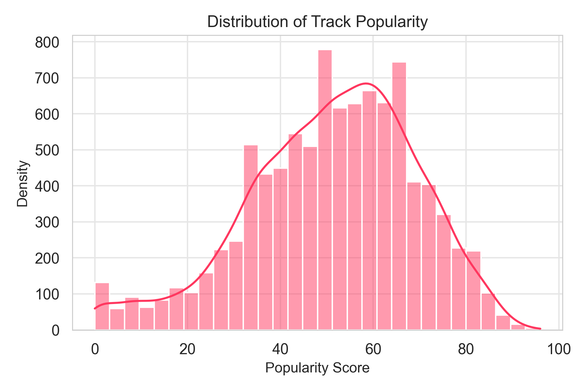

# 🎧 What Drives Music Popularity?
### Behavioral Discovery & Underrated Track Analysis

Most popularity projects ask: *“What predicts success?”*  
This project asks: **“When predictions fail, why?”**

We model **expected popularity** using artist reputation + historical momentum, then analyze **residuals (actual − predicted)** to uncover behavioral and exposure-driven effects that traditional models miss.

This approach surfaces:
- **Hidden gems** (underrated tracks)
- **Surprise hits**
- **Genre-level discovery bias**
- **Systemic exposure inequalities** in recommendation systems

---

## 🚀 Key Insights  
Full write-up: **[reports/behavioral_discovery_analysis.md](reports/behavioral_discovery_analysis.md)**

- **Audio features alone** have near-zero predictive power (**R² = 0.003**)
- **Artist reputation** explains baseline popularity (**R² = 0.104**)
- **Artist + momentum** improves prediction, but most variance remains (**best R² = 0.198**)  
- **~20% of tracks** behave unexpectedly (top/bottom 10% residuals)
- **Niche genres** are disproportionately underrated; **mainstream genres** are amplified

---

## 📊 Visual Highlights

### Popularity Distribution


### Model Fit (Actual vs Predicted)


### Residual Distribution


### Underrated Genre Bias


### Surprise Hit Genre Bias


---

## 🧠 Method Overview

### Step 1 — Baseline Model (Expected Popularity)
Predict expected popularity using:
- artist popularity
- follower count
- prior release performance (momentum)
- historical averages
- track duration

### Step 2 — Residual Analysis (Discovery Gap Signal)
Compute residuals:

`residual = actual − predicted`

Interpretation:
- positive → **surprise hit**
- negative → **underrated**
- near zero → **expected**

### Step 3 — Segment & Diagnose
Profile segments to detect:
- genre patterns
- exposure gaps
- behavioral effects

---

## 📄 Reports & Slides
- Report: **[reports/behavioral_discovery_analysis.md](reports/behavioral_discovery_analysis.md)**
- Slides: **[reports/discovery_analysis_slides.pdf](reports/discovery_analysis_slides.pdf)**

---

## 📂 Repository Structure

```bash
what-drives-music-popularity/
├── data/
│ ├── raw/
│ └── processed/
│
├── notebooks/
│ ├── 01_data_audit.ipynb
│ ├── 02_audio_features_librosa.ipynb
│ ├── 03_build_base_aligned.ipynb
│ ├── 04_exploratory_data_analysis.ipynb
│ ├── 05_audio_modeling.ipynb
│ └── 06_discovery_and_underrated_track.ipynb
│
├── images/
│ └── discovery/
│ ├── fig13_popularity_distribution.png
│ ├── fig14_actual_vs_predicted.png
│ ├── fig15_residual_distribution.png
│ ├── fig18_underrated_genre_bias.png
│ └── fig19_surprise_genre_bias.png
│
├── reports/
│ ├── behavioral_discovery_analysis.md
│ └── discovery_analysis_slides.pdf
│
├── README.md
└── requirements.txt
```

---

## 🛠 Tech Stack
- Python (Pandas, scikit-learn)
- Librosa
- Matplotlib / Seaborn
- Tableau (dashboard)

---

## 🎯 Why This Matters
Prediction explains only part of popularity. Residual analysis reveals where discovery systems may be missing value:
- overlooked content
- hidden opportunities
- systematic exposure bias

This supports product ideas like:
- residual-aware ranking
- hidden gem surfacing
- playlist diversification
- long-tail engagement improvements

---

## 👤 Author
Lucy Roh  
Behavioral Data Analytics • UX Research • Music Intelligence