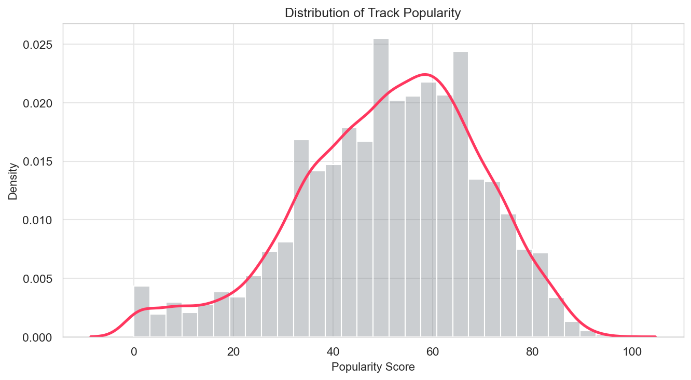
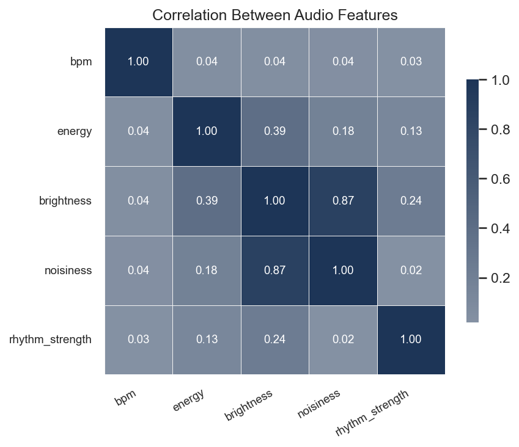
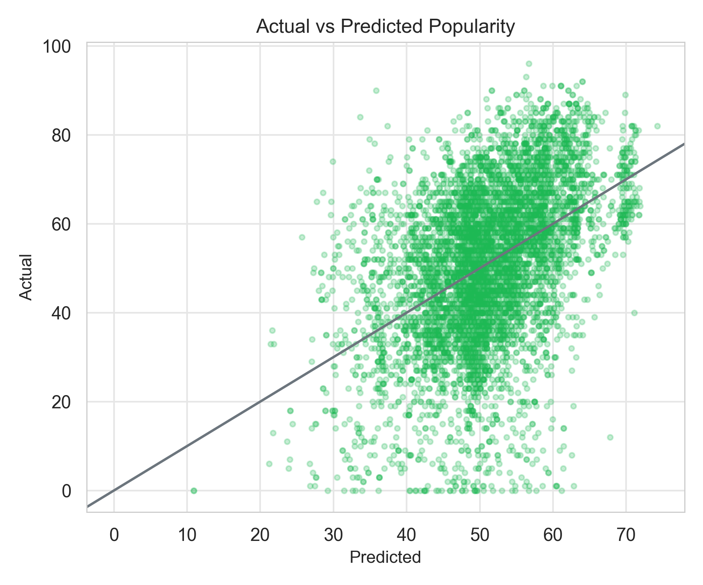
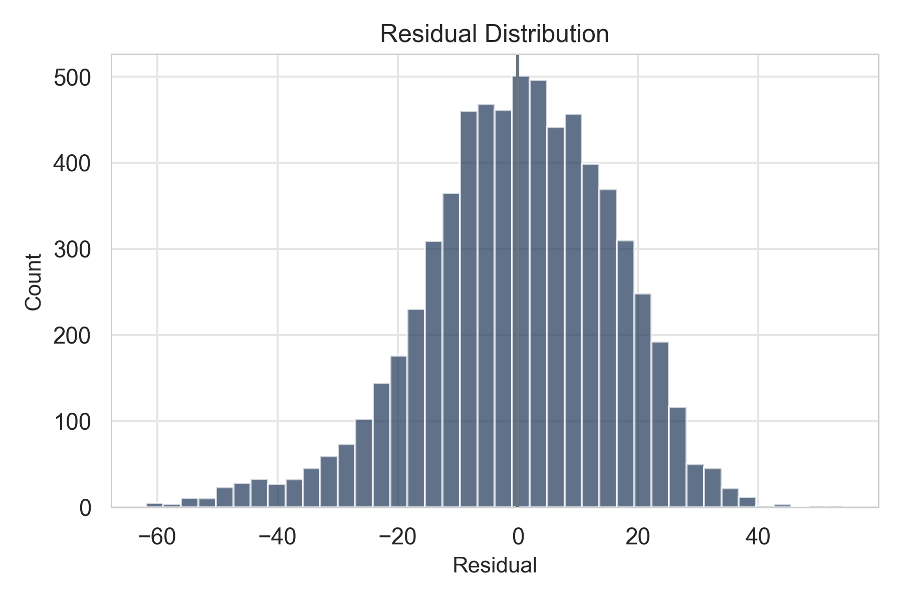
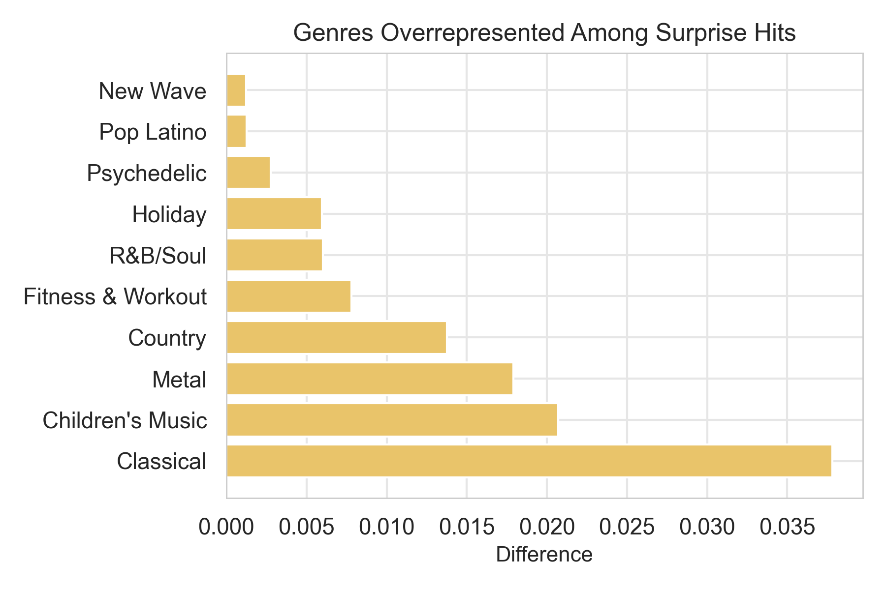

# Behavioral Discovery Analysis of Music Popularity
### Understanding Why Some Songs Overperform or Underperform Expectations

---

## 1. Objective

Most popularity analyses focus on predicting success from artist reputation or historical trends.

However, prediction alone does not explain **why certain songs unexpectedly succeed or fail**.

This project investigates:

> **When popularity predictions are wrong, what behavioral or market factors explain the gap?**

To answer this, we:
1. Explore the dataset through EDA
2. Build a baseline popularity model
3. Analyze residuals to uncover discovery gaps and exposure biases

---

# 2. Exploratory Data Analysis (EDA)

## 2.1 Popularity Distribution

Track popularity is broadly centered around mid-range values with long tails.

- Most songs cluster between 30–70
- Extreme hits and extreme failures are relatively rare

This suggests:
- popularity is noisy
- deterministic prediction is unlikely
- behavioral or contextual effects may play a strong role

---

## 2.2 Artist Strength vs Track Success

Initial exploration shows:

- more popular artists tend to have higher-performing tracks
- follower count correlates with visibility
- recent success (momentum) carries forward

This confirms the presence of **cumulative advantage effects**:

> “successful artists become more successful”

However, large variability remains even within the same artist,
indicating that artist strength alone cannot fully explain outcomes.

---

## 2.3 Audio Feature Patterns

Audio features (tempo, energy, brightness, rhythm strength) show:

- moderate correlations with popularity
- no single dominant predictor

This suggests:
- musical characteristics contribute partially
- but platform exposure and behavioral dynamics likely matter more

---

# 3. Baseline Modeling

## 3.1 Model Design

We trained a linear regression model to estimate **expected popularity** using:

- artist popularity
- follower count
- previous release performance
- historical average momentum
- track duration

These variables represent structural or historical signals available prior to release.

---

## 3.2 Model Fit

The model captures general trends:

- strong artists tend to perform well
- momentum predicts continued success

However:

- significant residual variance remains
- many tracks deviate substantially from predictions

Conclusion:

> Popularity is only partially explained by reputation and history.

This motivates analyzing **prediction errors** rather than predictions alone.

---

# 4. Residual-Based Discovery Analysis

## 4.1 Residual Definition

We compute: $residual = actual - predicted$

Interpretation:

- positive → surprise hit
- negative → underrated track

Residuals isolate behavioral or exposure-driven effects not captured by the model.

---

## 4.2 Segmenting Tracks

Tracks are grouped into:

- Surprise Hits
- Expected
- Underrated

Approximately **20% of tracks fall outside expectations**.

This indicates substantial discovery opportunities rather than random noise.

---

# 5. Findings

## 5.1 Underrated Tracks

Underrated songs show:

- similar artist popularity
- similar followers
- similar momentum
- similar duration

Yet they perform significantly worse.

Key difference:

### Genre concentration

Underrated tracks over-index in:

- Classical
- Children’s
- Country
- Metal
- other niche genres

Interpretation:

> These tracks are not weaker — they are underexposed.

This suggests potential **discovery blind spots** in recommendation systems.

---

## 5.2 Surprise Hits

Surprise hits show:

- average or slightly weaker artist history
- lower momentum than expected
- but strong overperformance

Key difference:

### Mainstream genre amplification

Overrepresented genres include:

- Pop
- Rock
- R&B

Interpretation:

> Mainstream genres receive disproportionate visibility or amplification.

---

# 6. Interpretation

Together, these patterns suggest:

Popularity is not purely merit-based.

Instead, success is shaped by:

- historical reputation
- platform exposure
- recommendation mechanics
- genre biases

Discovery systems appear to:

- amplify already mainstream content
- under-serve niche genres

This creates structural inequalities in visibility.

---

# 7. Product & UX Implications

These insights can inform:

- hidden gem surfacing features
- fair exposure ranking
- playlist diversification
- marketing prioritization
- improved cold-start handling
- more equitable discovery systems

Residual-based analysis provides a practical way to detect where recommendation systems may be missing value.

---

# 8. Conclusion

Prediction explains part of popularity, but not all.

By focusing on **when predictions fail**, we uncover:

- overlooked opportunities
- unexpected successes
- systemic exposure effects

This behavioral perspective enables more effective and more equitable music discovery experiences.

---

## Repository Links

Notebook: (../notebooks/06_discovery_and_underrated_track.ipynb)
Figures: (../images) 
Dashboard: Tableau (link)  